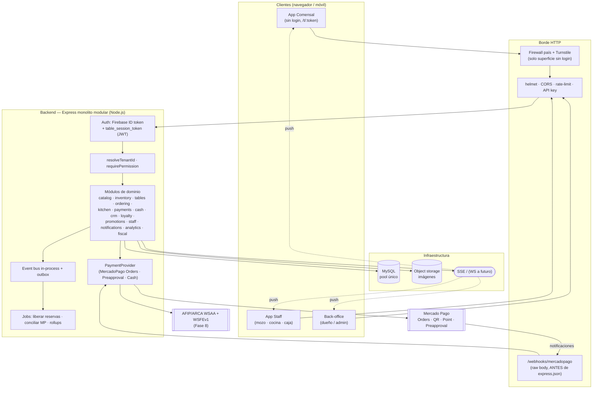
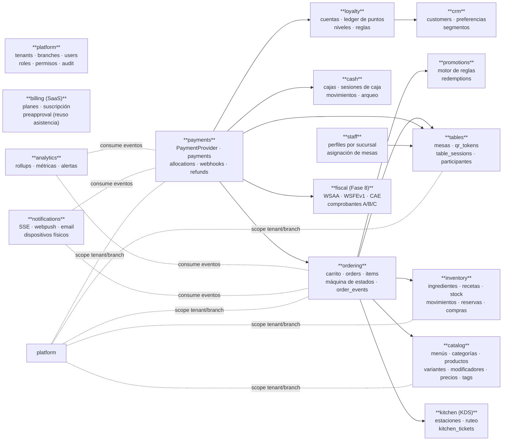
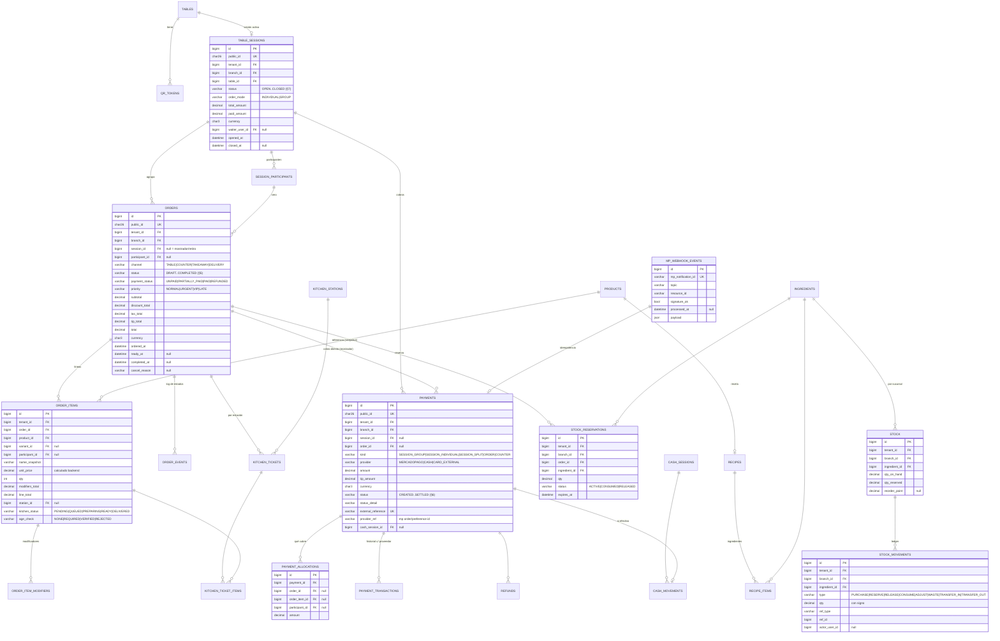
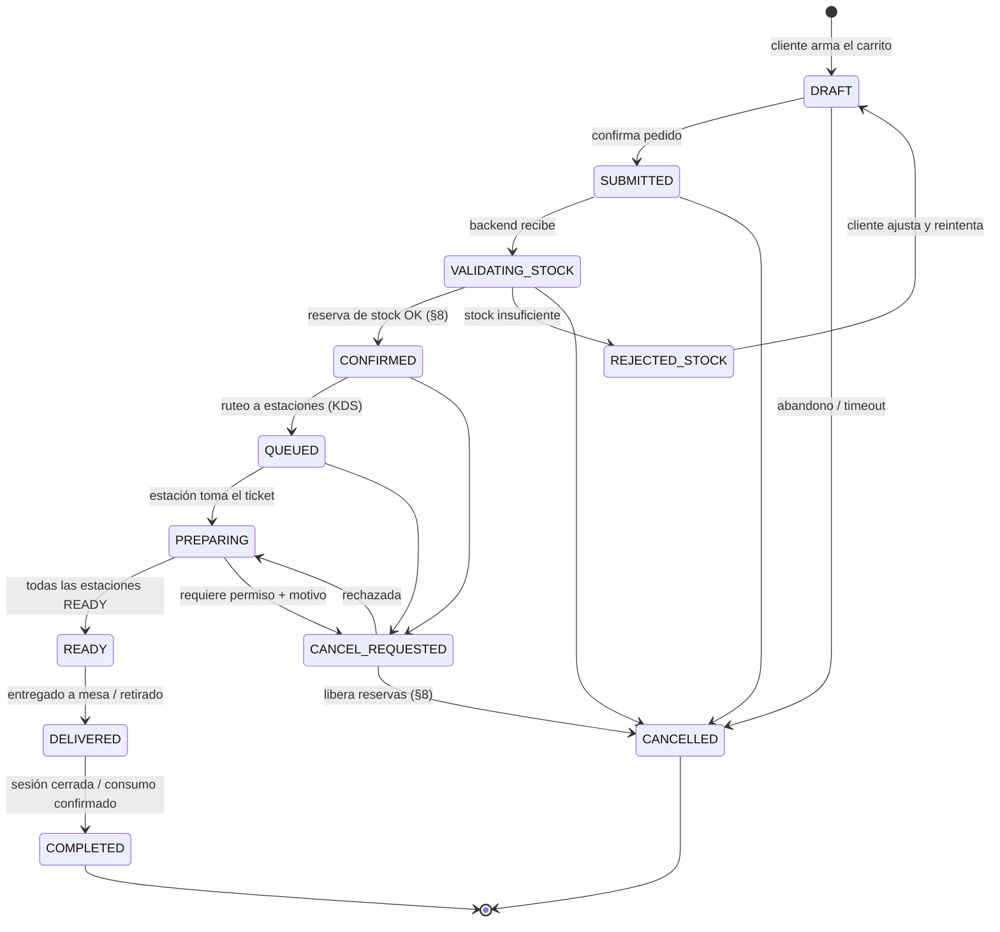
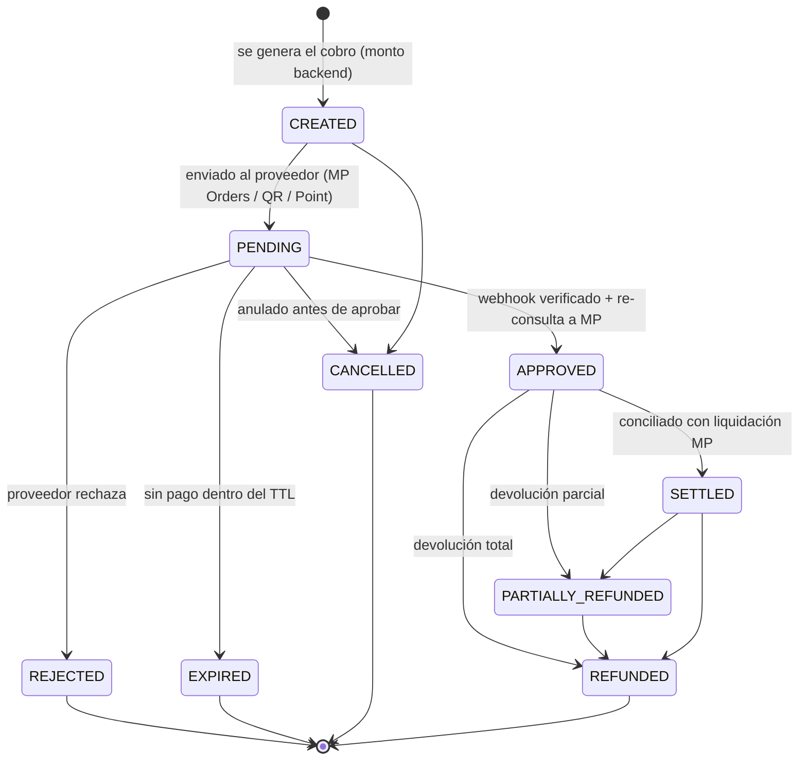
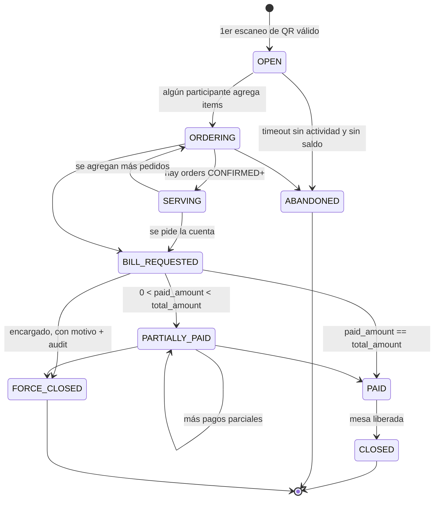
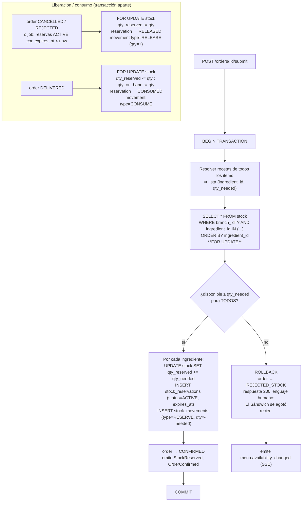
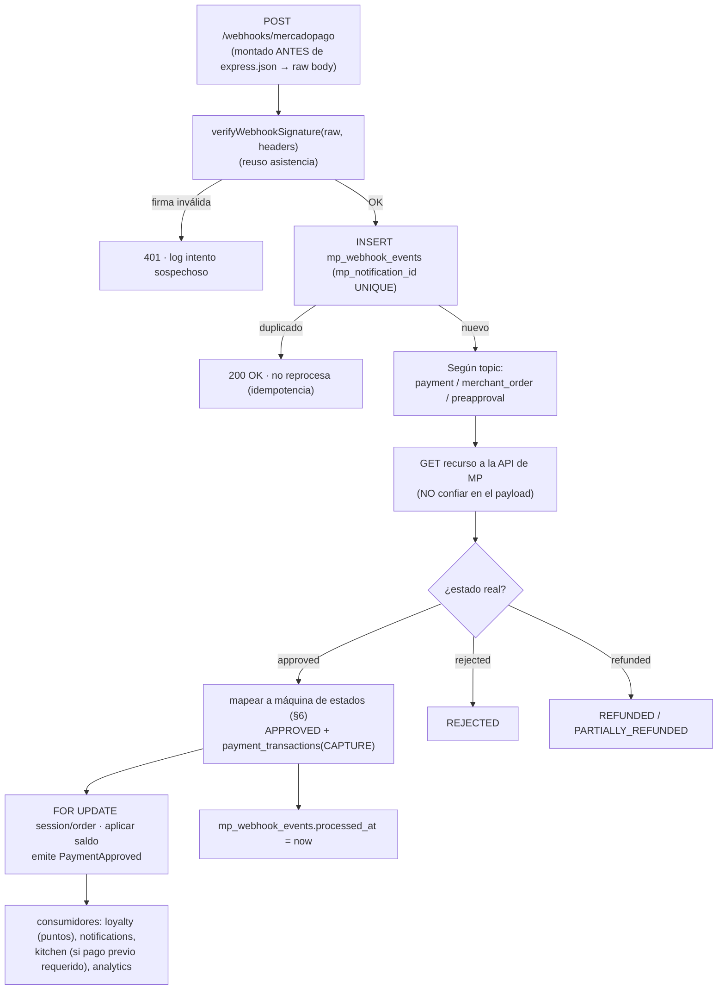
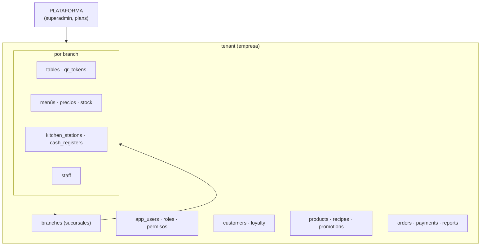

# Arquitectura v1 — Sistema operativo para gastronomía (SaaS)

> Entregable de la **Fase 0** (sección 76 de `prompt.txt` / punto 5 de `INSTRUCCIONES.md`).
> Todavía **no se escribe código**: esto es lo que hay que validar antes.
>
> **Decisión de stack tomada: Camino C** — Node.js + **Express + JavaScript** + `mysql2`
> (sin ORM), con estructura estricta por dominio (route / controller / service /
> repository + DTO `zod`). TypeScript se suma de a poco. Motivo: reúso máximo de la
> infra ya probada del sistema de asistencia (`horasDedicacionOnline`) sin pagar el
> costo de reescribir auth + RBAC + multi-tenant + billing en otro framework.

Índice:

1. [Arquitectura general](#1-arquitectura-general)
2. [Arquitectura de módulos (bounded contexts)](#2-arquitectura-de-módulos-bounded-contexts)
3. [Modelo de dominio](#3-modelo-de-dominio)
4. [ERD inicial MySQL](#4-erd-inicial-mysql)
5. [Máquina de estados — Order](#5-máquina-de-estados--order)
6. [Máquina de estados — Payment](#6-máquina-de-estados--payment)
7. [Máquina de estados — TableSession](#7-máquina-de-estados--tablesession)
8. [Flujo de stock (reserva y concurrencia)](#8-flujo-de-stock-reserva-y-concurrencia)
9. [Flujo de pedidos concurrentes desde la misma mesa](#9-flujo-de-pedidos-concurrentes-desde-la-misma-mesa)
10. [Flujo de pago individual](#10-flujo-de-pago-individual)
11. [Flujo de pago conjunto](#11-flujo-de-pago-conjunto)
12. [Flujo Mercado Pago](#12-flujo-mercado-pago)
13. [Modelo multi-tenant](#13-modelo-multi-tenant)
14. [RBAC](#14-rbac)
15. [Seguridad del QR](#15-seguridad-del-qr)
16. [Arquitectura Angular](#16-arquitectura-angular)
17. [Arquitectura backend (Express estructurado)](#17-arquitectura-backend-express-estructurado)
18. [Estructura MySQL / convenciones](#18-estructura-mysql--convenciones)
19. [Plan de testing](#19-plan-de-testing)
20. [Roadmap por fases + AFIP](#20-roadmap-por-fases--afip)
21. [Riesgos](#21-riesgos)
22. [MVP: qué entra y qué queda afuera](#22-mvp-qué-entra-y-qué-queda-afuera)
23. [Decisiones técnicas — resumen](#23-decisiones-técnicas--resumen)

---

## 1. Arquitectura general

**Monolito modular** en un **único repositorio** y un **único deploy** (lección de
`INSTRUCCIONES.md` §3.5: el sistema de asistencia quedó partido en 2 repos y fue una
molestia). Nada de microservicios al inicio; los módulos se diseñan desacoplados para
poder separarlos después si el volumen lo pide.



**Principios rectores (de `prompt.txt`):**

- El backend es la única fuente de verdad de **precio**, **stock/disponibilidad** y
  **estado de pago**. El front nunca los envía ni los decide.
- Toda entidad de negocio pertenece a un **tenant** (y a un **branch** cuando aplica).
  Ninguna consulta sin `tenant_id` en el `WHERE` (salvo tablas de plataforma).
- Máquinas de estado formales para `Order`, `Payment`, `TableSession`. Nada de un
  `status` string sin reglas de transición.
- Concurrencia de stock y de pagos con **locking pesimista** (`SELECT ... FOR UPDATE`),
  no con Redis (todavía).
- Tiempo real por **SSE** (server→cliente basta para KDS, seguimiento de pedido, stock,
  actividad de mesa). WebSocket solo si aparece necesidad bidireccional real.

**Reúso desde el sistema de asistencia** (rutas relativas a
`C:\angular\horasDedicacionOnline\backendonline2\`):

| Se reusa | Origen | Nota |
|---|---|---|
| Pool único `mysql2` | `db.js` | `connectionLimit` por debajo del límite del hosting. Todo el código usa ESE. |
| Auth Firebase (email + Google) | frontend `src/app/core/auth.ts`, interceptor, `test-helpers/firebaseTestAuth.js` | Mantener `authStateReady()` y recarga completa en login/logout. |
| Multi-tenant + RBAC | `appUserMiddleware.js` (`resolveTenantId`, `requirePermission`, `requireSuperadmin`) + tablas `app_users`/`roles`/`role_permissions`/`user_permissions` | Modelo permiso = `"modulo:accion"`. |
| Test de aislamiento | `test/full-tenant-isolation.test.js` | **Copiar el enfoque tal cual** (ver §19). |
| Seguridad HTTP | `security.js`, `motor-laboral/middleware/countryFirewallMiddleware.js`, `motor-laboral/services/turnstileService.js` | Firewall país + captcha en superficie sin login. |
| Firma webhook MP | `motor-laboral/services/mercadopagoService.js` (`verifyWebhookSignature`) + `routes/mercadopagoWebhook.js` | Montar webhook ANTES de `express.json()`. Reusable casi tal cual. |
| Suscripción SaaS (dueño paga el software) | `routes/billing.js`, `motor-laboral/services/mercadopagoService.js`, tablas `tenant_subscriptions`/`plans`/`payment_records`/`plan_requests` | Preapproval. Distinto del cobro al comensal. |
| Migraciones idempotentes | `migrations/*.sql` + `run-sql.js` | Cada `.sql` corre una vez; `information_schema` para chequeos condicionales. |
| Config del suite de tests | `package.json` → `node --test --test-force-exit --test-concurrency=1` | `--test-force-exit`: el pool mantiene vivo el proceso. `--concurrency=1`: los tests contra DB real se pisan. |
| Shell Angular, tema, estilos, guards, pantallas de plataforma | `src/app/core/shell/`, `core/theme.ts`, `styles.css`, `shared/`, `app.routes.ts`, `permission-guard.ts`, `tenants/ billing/ users/ security/` | Angular es Angular. |

---

## 2. Arquitectura de módulos (bounded contexts)

Cada módulo = una carpeta `src/modules/<nombre>/` con sus capas. Los módulos se comunican
por: (a) llamadas directas a `service` de otro módulo cuando es síncrono y en la misma
transacción, (b) **eventos de dominio** (bus in-process + outbox) cuando es asíncrono o
cruza límites.



**Eventos de dominio** (nombres estables; `prompt.txt` §60):
`OrderCreated`, `OrderConfirmed`, `OrderCancelled`, `StockReserved`, `StockReleased`,
`StockConsumed`, `PaymentCreated`, `PaymentApproved`, `PaymentRejected`, `PaymentRefunded`,
`KitchenTicketStarted`, `KitchenTicketReady`, `OrderReady`, `OrderDelivered`,
`OrderCompleted`, `LoyaltyPointsEarned`, `LoyaltyPointsRedeemed`, `TableSessionOpened`,
`TableSessionClosed`, `AgeVerificationRequired`.

Implementación: `EventEmitter` in-process para reacción inmediata **+** tabla
`domain_events` (outbox) para lo que debe sobrevivir un reinicio o alimentar
integraciones/analytics. Un worker lee el outbox y despacha. Los consumidores son
idempotentes.

---

## 3. Modelo de dominio

### 3.1 Agregados y sus invariantes

| Agregado | Raíz | Invariantes que el `service` debe garantizar |
|---|---|---|
| **TableSession** | `table_sessions` | Una mesa tiene a lo sumo **una** sesión no cerrada. No pasa a `PAID`/`CLOSED` con `paid_amount != total_amount`. `total_amount` = suma de totales de sus orders no cancelados. |
| **Order** | `orders` (+ `order_items`, `order_item_modifiers`) | El total lo calcula el backend desde `products`/overrides/variantes/modificadores/promos, nunca desde el request. Transiciones de estado solo por la máquina (§5). Sin cambios de items cuando `payment_status != UNPAID` salvo permiso staff + `audit_log`. Cada item alcohólico ⇒ `age_check = REQUIRED`. |
| **Stock (por branch+ingrediente)** | `stock` | `qty_reserved <= qty_on_hand` siempre. Toda variación deja un `stock_movements` (ledger, nunca `UPDATE`). Reservar/consumir/liberar solo dentro de transacción con `SELECT ... FOR UPDATE` sobre la fila. |
| **Payment** | `payments` (+ `payment_allocations`, `payment_transactions`) | `APPROVED` solo por confirmación backend (webhook con firma verificada **+** re-consulta a MP). Idempotencia por `mp_webhook_events.mp_notification_id`. La suma de allocations ≤ `amount`. Aplicar un pago a una sesión toma `FOR UPDATE` sobre `table_sessions`. |
| **CashSession** | `cash_sessions` | Una caja tiene a lo sumo una sesión `OPEN`. `difference = closing_amount - expected_amount`. Cada `cash_movements` referencia su `payment` cuando corresponde. |
| **LoyaltyAccount** | `loyalty_accounts` (+ `loyalty_transactions`) | `points_balance` = suma del ledger. Nunca `UPDATE` directo del balance sin transacción del ledger + `audit_log`. |
| **QRToken** | `qr_tokens` | Token opaco (≥32 bytes aleatorios). Un solo `ACTIVE` por mesa. Rotar ⇒ el anterior pasa a `ROTATED`. Resuelve tenant/branch/table **server-side**. |

### 3.2 Conceptos clave del producto

- **TableSession ≠ Order.** Una sesión de mesa agrupa varios pedidos individuales
  (`ORDER A`, `ORDER B`, …) de distintos participantes (`prompt.txt` §6).
- **OrderMode**: `INDIVIDUAL` (cada participante su pedido) o `GROUP` (un pedido común).
  Se puede cambiar el **modo de pago** después.
- **GUEST MODE**: el comensal nunca está obligado a registrarse. Se identifica por
  `session_participants` (nombre temporal / nickname / nº de asiento / anónimo). La
  conversión a `customers` registrado ocurre después.
- **Dimensión operativa vs. dimensión de pago del Order**: `orders.status` (cocina/
  entrega) y `orders.payment_status` son ejes **independientes**. Un pedido de mostrador
  puede estar `PAID` + `PREPARING`; un pedido de mesa puede estar `COMPLETED` + `UNPAID`.
- **Smart Waiting**: el dispositivo físico (buzzer) y el celular son dos interfaces del
  mismo motor de estados del pedido. Estimaciones con histórico real, en rangos.

---

## 4. ERD inicial MySQL

Convenciones completas en §18. Acá: el **núcleo transaccional** como diagrama, y el
resto como listas de columnas. Toda tabla de negocio lleva además
`tenant_id`, `created_at`, `updated_at` (y `branch_id`, `created_by`, `updated_by`,
`deleted_at` donde corresponda) aunque no se repita abajo.

### 4.1 Núcleo: sesión de mesa → pedido → stock → pago



### 4.2 Plataforma e identidad

- **tenants** `(id, name, slug UK, status, plan_id FK NULL, created_at)` — sin `tenant_id`.
- **plans** `(id, code UK, name, price, interval, features JSON)` — plataforma.
- **tenant_subscriptions** `(id, tenant_id FK, plan_id FK, status, current_period_end, mp_preapproval_id, cancel_at NULL)`.
- **payment_records** / **plan_requests** — reuso directo de asistencia (facturación SaaS).
- **branches** `(id, tenant_id FK, code, name, timezone, address JSON, status)` — `UNIQUE(tenant_id, code)`.
- **app_users** `(id, tenant_id FK NULL, firebase_uid UK, email, display_name, is_superadmin BOOL, default_branch_id FK NULL, status)` — `UNIQUE(tenant_id, email)`.
- **roles** `(id, tenant_id FK NULL, code, name, is_system BOOL)` — `UNIQUE(tenant_id, code)`. `tenant_id NULL` = preset de plataforma.
- **role_permissions** `(role_id FK, permission VARCHAR(64))` — `PK(role_id, permission)`.
- **user_roles** `(app_user_id FK, role_id FK, branch_id FK NULL)` — `PK(app_user_id, role_id, branch_id)`.
- **user_permissions** `(app_user_id FK, permission, effect ENUM('ALLOW','DENY'), branch_id FK NULL)` — overrides individuales.
- **audit_log** `(id, tenant_id, branch_id NULL, actor_user_id NULL, actor_kind ENUM('user','guest','system'), ip, entity_type, entity_id, action, before JSON, after JSON, reason, created_at)` — `INDEX(tenant_id, entity_type, entity_id)`, `INDEX(tenant_id, created_at)`.
- **domain_events** `(id, tenant_id, branch_id NULL, type, payload JSON, occurred_at, dispatched_at NULL, attempts INT DEFAULT 0)` — `INDEX(dispatched_at)`. Outbox.
- **settings** `(id, tenant_id, branch_id NULL, key, value JSON)` — `UNIQUE(tenant_id, branch_id, key)`. Config por negocio (`prompt.txt` §70): propina, caducidad de puntos, horarios, stock mínimo, edad mínima, política de cancelación, etc.

### 4.3 Catálogo (menú)

- **menus** `(id, tenant_id, branch_id NULL, code, name, status)` — `UNIQUE(tenant_id, branch_id, code)`. `branch_id NULL` = menú global.
- **menu_categories** `(id, tenant_id, menu_id FK, code, name, sort_order, icon, active_from TIME NULL, active_to TIME NULL, days_mask TINYINT NULL)` — `UNIQUE(tenant_id, menu_id, code)`.
- **products** `(id, tenant_id, code, name, description, category_id FK, base_price DECIMAL(12,2), currency, image_url, prep_minutes, requires_age_verification BOOL, is_active, sort_order)` — `UNIQUE(tenant_id, code)`.
- **product_branch_overrides** `(product_id FK, branch_id FK, price DECIMAL(12,2) NULL, is_available BOOL DEFAULT 1)` — `PK(product_id, branch_id)`. Precio/disponibilidad por sucursal (`prompt.txt` §3).
- **product_variants** `(id, tenant_id, product_id FK, code, name, price_delta DECIMAL(12,2), prep_minutes_delta, is_default BOOL)` — `UNIQUE(tenant_id, product_id, code)`.
- **modifier_groups** `(id, tenant_id, code, name, min_select, max_select, required BOOL)` — `UNIQUE(tenant_id, code)`.
- **modifiers** `(id, tenant_id, group_id FK, code, name, price_delta DECIMAL(12,2))` — `UNIQUE(tenant_id, group_id, code)`.
- **product_modifier_groups** `(product_id FK, group_id FK, sort_order)` — `PK(product_id, group_id)`.
- **product_tags** `(id, tenant_id, code, label, color)` + **product_tag_map** `(product_id FK, tag_id FK)` — `PK(product_id, tag_id)`.

### 4.4 Inventario

- **ingredients** `(id, tenant_id, code, name, unit ENUM('g','kg','ml','l','unit'), is_tracked BOOL DEFAULT 1)` — `UNIQUE(tenant_id, code)`.
- **recipes** `(id, tenant_id, product_id FK NULL, variant_id FK NULL, yield_qty DECIMAL(12,3) DEFAULT 1)` — `UNIQUE(tenant_id, product_id, variant_id)`.
- **recipe_items** `(id, recipe_id FK, ingredient_id FK, qty DECIMAL(12,3))` — `UNIQUE(recipe_id, ingredient_id)`.
- **stock** — ver §4.1. `UNIQUE(tenant_id, branch_id, ingredient_id)`. **Fila que se bloquea con `FOR UPDATE`.**
- **stock_movements** — ver §4.1. Ledger append-only. `INDEX(tenant_id, branch_id, ingredient_id, created_at)`.
- **stock_reservations** — ver §4.1. `INDEX(status, expires_at)`, `INDEX(order_id)`.
- **suppliers** `(id, tenant_id, code, name, contact JSON)` — `UNIQUE(tenant_id, code)`.
- **purchases** `(id, tenant_id, branch_id, supplier_id FK, status, total DECIMAL(12,2), received_at)` + **purchase_items** `(id, purchase_id FK, ingredient_id FK, qty DECIMAL(12,3), unit_cost DECIMAL(12,2))`.

### 4.5 Mesas y sesiones

- **tables** `(id, tenant_id, branch_id FK, code, name, seats, zone, status ENUM('FREE','RESERVED','OCCUPIED','BILL_REQUESTED','CLOSING'), current_session_id FK NULL)` — `UNIQUE(tenant_id, branch_id, code)`.
- **qr_tokens** `(id, tenant_id, branch_id FK, table_id FK, token VARCHAR(64), status ENUM('ACTIVE','ROTATED','REVOKED'), created_at, rotated_at NULL)` — `UNIQUE(token)`, `INDEX(tenant_id, branch_id, table_id, status)`.
- **table_sessions** — ver §4.1. `INDEX(tenant_id, branch_id, status)`. **Fila que se bloquea con `FOR UPDATE` al aplicar pagos.**
- **session_participants** `(id, public_id CHAR(26) UK, tenant_id, session_id FK, display_name, nickname NULL, seat_no NULL, customer_id FK NULL, kind ENUM('GUEST','REGISTERED'), joined_at)` — `INDEX(session_id)`.

### 4.6 Pedidos y cocina

- **orders**, **order_items**, **order_item_modifiers** — ver §4.1. `order_item_modifiers` guarda `name_snapshot` + `price_delta` (no depende de que el modifier siga existiendo).
- **order_events** `(id, tenant_id, order_id FK, from_status, to_status, actor_kind, actor_id NULL, reason, created_at)` — `INDEX(order_id, created_at)`. Log de la máquina de estados.
- **kitchen_stations** `(id, tenant_id, branch_id FK, code, name, type ENUM('KITCHEN','BAR','COFFEE','COLD','DESSERT'))` — `UNIQUE(tenant_id, branch_id, code)`.
- **product_station_routing** `(id, tenant_id, product_id FK NULL, category_id FK NULL, station_id FK)` — resolver por producto, fallback categoría.
- **kitchen_tickets** `(id, tenant_id, branch_id, order_id FK, station_id FK, status ENUM('QUEUED','PREPARING','READY','DELIVERED'), sequence_no, created_at, started_at NULL, ready_at NULL)` — `INDEX(tenant_id, branch_id, station_id, status)`.
- **kitchen_ticket_items** `(id, ticket_id FK, order_item_id FK, qty, status)`.

### 4.7 Pagos y caja

- **payments**, **payment_allocations**, **payment_transactions**, **mp_webhook_events** — ver §4.1.
- **payment_transactions** `(id, tenant_id, payment_id FK, type ENUM('AUTHORIZE','CAPTURE','REFUND','CHARGEBACK'), provider_txn_id, amount DECIMAL(12,2) con signo, status, raw JSON, created_at)`.
- **refunds** `(id, tenant_id, payment_id FK, amount DECIMAL(12,2), reason, status, provider_ref, created_by, created_at)`.
- **cash_registers** `(id, tenant_id, branch_id FK, code, name)` — `UNIQUE(tenant_id, branch_id, code)`.
- **cash_sessions** `(id, tenant_id, branch_id, register_id FK, opened_by FK, opened_at, opening_amount DECIMAL(12,2), closed_by NULL, closed_at NULL, closing_amount NULL, expected_amount NULL, difference NULL, status ENUM('OPEN','CLOSED'))` — `INDEX(tenant_id, branch_id, status)`.
- **cash_movements** `(id, tenant_id, branch_id, cash_session_id FK, type ENUM('SALE','REFUND','PAYOUT','DEPOSIT','ADJUST'), amount DECIMAL(12,2) con signo, payment_id FK NULL, reason, actor_user_id, created_at)` — `INDEX(cash_session_id)`.

### 4.8 CRM, fidelización, promociones

- **customers** `(id, tenant_id, code, name, phone, email, birth_date NULL, home_branch_id NULL, consent JSON, first_seen_at, last_order_at NULL)` — `UNIQUE(tenant_id, phone)`, `UNIQUE(tenant_id, email)`.
- **customer_preferences** `(customer_id FK, key, value)` — `PK(customer_id, key)`.
- **loyalty_tiers** `(id, tenant_id, code, name, min_points, multiplier DECIMAL(4,2), benefits JSON)` — `UNIQUE(tenant_id, code)`.
- **loyalty_accounts** `(id, tenant_id, customer_id FK, points_balance INT DEFAULT 0, tier_id FK NULL, updated_at)` — `UNIQUE(tenant_id, customer_id)`.
- **loyalty_transactions** `(id, tenant_id, account_id FK, type ENUM('EARN','REDEEM','EXPIRE','ADJUST','REVERSAL'), points INT con signo, ref_type, ref_id, reason, actor_kind, actor_id NULL, expires_at NULL, created_at)` — `INDEX(account_id, created_at)`. **Ledger; el balance se deriva.**
- **loyalty_rules** `(id, tenant_id, scope, points_per_amount DECIMAL(12,4), multiplier_conditions JSON, active BOOL)`.
- **promotions** `(id, tenant_id, code, name, type ENUM('PERCENT','FIXED','BOGO','COMBO','FREE_ITEM','HAPPY_HOUR'), value DECIMAL(12,2), priority INT, stackable BOOL DEFAULT 0, active_from, active_to, status)` — `UNIQUE(tenant_id, code)`.
- **promotion_rules** `(id, promotion_id FK, condition_type ENUM('BRANCH','CATEGORY','PRODUCT','TIME','DAY','MIN_QTY','CUSTOMER_TIER','MIN_AMOUNT'), operator, value JSON)`.
- **promotion_redemptions** `(id, tenant_id, promotion_id FK, order_id FK, amount_discounted DECIMAL(12,2), created_at)` — `INDEX(promotion_id)`, `INDEX(order_id)`.

### 4.9 Staff, notificaciones, dispositivos

- **staff_profiles** `(id, tenant_id, app_user_id FK, branch_id FK, code, display_name, pin_hash NULL, active BOOL)` — `UNIQUE(tenant_id, branch_id, code)`. PIN para acciones rápidas en tablet.
- **waiter_table_assignments** `(id, tenant_id, branch_id, table_id FK, staff_user_id FK, kind ENUM('PRIMARY','COVER'), active_from, active_to NULL)` — `INDEX(tenant_id, branch_id, table_id)`.
- **devices** `(id, tenant_id, branch_id FK, code, kind ENUM('BUZZER','PRINTER','KDS_SCREEN'), status, last_seen_at)` — `UNIQUE(tenant_id, branch_id, code)`.
- **device_assignments** `(id, tenant_id, device_id FK, order_id FK, assigned_at, released_at NULL)` — `INDEX(order_id)`.
- **notifications** `(id, tenant_id, branch_id NULL, target_kind ENUM('GUEST','CUSTOMER','USER','DEVICE'), target_ref, channel ENUM('SSE','WEBPUSH','EMAIL','SMS','WHATSAPP','DEVICE'), template, payload JSON, status, sent_at NULL, created_at)` — `INDEX(tenant_id, status)`.

### 4.10 Fiscal (Fase 8 — esbozo)

- **fiscal_config** `(id, tenant_id, branch_id, cuit, pos_no, cert_ref, environment ENUM('HOMOLOGACION','PRODUCCION'), default_doc_type)` — `UNIQUE(tenant_id, branch_id)`.
- **afip_tokens** `(id, tenant_id, service, token TEXT, sign TEXT, generated_at, expires_at)` — `INDEX(tenant_id, service, expires_at)`. WSAA.
- **tax_rates** `(id, tenant_id, code, name, rate DECIMAL(6,3), kind)` — `UNIQUE(tenant_id, code)`.
- **fiscal_documents** `(id, tenant_id, branch_id, order_id FK NULL, session_id FK NULL, doc_type ENUM('A','B','C','NC_A','NC_B','NC_C'), pos_no, number BIGINT NULL, cae VARCHAR(20) NULL, cae_expires_at NULL, status ENUM('DRAFT','PENDING','AUTHORIZED','REJECTED','CONTINGENCY'), net DECIMAL(12,2), iva DECIMAL(12,2), total DECIMAL(12,2), customer_doc_type, customer_doc_no, raw_request JSON, raw_response JSON, created_at)` — `UNIQUE(tenant_id, branch_id, pos_no, doc_type, number)`.
- **fiscal_document_items** `(id, document_id FK, description, qty, unit_price, net, iva_rate_id FK, iva_amount, total)`.

### 4.11 Analítica (Fase 12 — al inicio, consultas directas)

- **daily_sales_rollup** `(tenant_id, branch_id, date, orders_count, gross, discounts, net, tips, refunds, avg_ticket)` — `PK(tenant_id, branch_id, date)`.
- **product_sales_rollup** `(tenant_id, branch_id, date, product_id, qty, gross, margin_est)` — `PK(tenant_id, branch_id, date, product_id)`.

---

## 5. Máquina de estados — Order

`orders.status` (eje operativo). El eje de pago es `orders.payment_status` y es
independiente.



**Reglas:**

- Transición solo por `ordering.service` mediante `transition(order, to, ctx)`; cada
  cambio escribe `order_events`.
- `DRAFT → CANCELLED` automático por job de timeout (config `settings`).
- `CONFIRMED..PREPARING → CANCEL_REQUESTED`: `QUEUED`/`CONFIRMED` lo puede hacer el
  comensal; desde `PREPARING` requiere `orders:cancel_after_prep` (staff) + `reason`.
- No se editan items si `payment_status != UNPAID` salvo `orders:amend_paid` + `audit_log`
  (anti-fraude `prompt.txt` §47: "modificación del pedido después del pago").
- `age_check`: si algún item tiene `age_check IN (REQUIRED)` sin resolver, el order puede
  llegar a `READY` pero **no** a `DELIVERED` (`prompt.txt` §28).

---

## 6. Máquina de estados — Payment



**Reglas (críticas — plata real):**

- `PENDING → APPROVED` **solo** desde el handler de webhook, tras (1) `verifyWebhookSignature`
  OK y (2) `GET` del recurso a la API de MP confirmando `status = approved`. Nunca por el
  retorno del navegador desde MP (`prompt.txt` §31).
- Idempotencia: cada notificación se registra en `mp_webhook_events` por
  `mp_notification_id UNIQUE`. Si ya está `processed_at`, se descarta.
- Efectivo (`CashProvider`): `CREATED → APPROVED` inmediato al registrar el cobro, con
  `cash_movements` asociado.
- Aplicar un `APPROVED` a una sesión: `SELECT ... FOR UPDATE` sobre `table_sessions`,
  sumar a `paid_amount`, y si `paid_amount > total_amount` ⇒ marcar para `refund`
  (protección doble cobro, `prompt.txt` §58 caso 2).

---

## 7. Máquina de estados — TableSession



**Reglas:**

- Una `table` tiene a lo sumo una sesión en estado no terminal. El 2º escaneo del mismo
  QR **recupera** la sesión existente y agrega un `session_participant`.
- `total_amount` se recalcula ante cada cambio de order (evento `OrderConfirmed` /
  `OrderCancelled`).
- No pasa a `PAID`/`CLOSED` si `paid_amount != total_amount`. `FORCE_CLOSED` es la única
  salida con saldo, y exige permiso + `reason` + `audit_log`.
- `ABANDONED`: job de timeout; si luego aparece un pago, se reabre a `BILL_REQUESTED`.

---

## 8. Flujo de stock (reserva y concurrencia)

Estrategia: **locking pesimista a nivel base** (`SELECT ... FOR UPDATE` sobre la fila de
`stock`), dentro de una transacción. Sin Redis (`INSTRUCCIONES.md` §3.3).

`stock` tiene `qty_on_hand`, `qty_reserved`. **Disponible = `qty_on_hand - qty_reserved`.**
La disponibilidad de un producto = `min` sobre los ingredientes de su receta de
`floor(disponible_ingrediente / qty_en_receta)`. La calcula el backend; el front solo la
muestra.



**Detalles:**

- `ORDER BY ingredient_id` en el `SELECT ... FOR UPDATE` para tomar los locks siempre en
  el mismo orden ⇒ sin deadlocks entre pedidos concurrentes.
- `expires_at` = `now + settings.reservation_ttl` (default p. ej. 15 min). El job
  `releaseExpiredReservations` corre cada minuto.
- `stock_movements` es append-only: reconstruye `qty_on_hand` y audita diferencias de
  inventario (`prompt.txt` §17: "diferencias de inventario", §47: "stock negativo").
- Productos sin receta / `is_tracked = 0`: no reservan, siempre disponibles.

---

## 9. Flujo de pedidos concurrentes desde la misma mesa

Caso central del producto (`prompt.txt` §6, §59; caso obligatorio 6 y 8). **Juan** y
**María** en la Mesa 8, misma `TableSession S`, ambos quieren el **último** sándwich
(stock para 1).

```mermaid
sequenceDiagram
    autonumber
    participant J as Juan (móvil)
    participant M as María (móvil)
    participant API as Backend (ordering)
    participant DB as MySQL
    participant SSE as SSE

    J->>API: POST /table-sessions {qr_token}
    API->>DB: recupera Session S, crea participant J
    API-->>J: table_session_token (JWT: sid=S, pid=J)
    M->>API: POST /table-sessions {qr_token}
    API->>DB: recupera Session S, crea participant M
    API-->>M: table_session_token (JWT: sid=S, pid=M)
    API-->>SSE: session.activity {S, participants:[J,M]}
    SSE-->>J: "Hay otra persona pidiendo en esta mesa"

    par Juan arma su pedido
        J->>API: POST /orders (sid=S, pid=J)  → Order OJ [DRAFT]
        J->>API: POST /orders/OJ/items {Sándwich x1}
    and María arma el suyo
        M->>API: POST /orders (sid=S, pid=M)  → Order OM [DRAFT]
        M->>API: POST /orders/OM/items {Sándwich x1}
    end
    Note over API,DB: OJ y OM son filas distintas: no colisionan al armarse

    J->>API: POST /orders/OJ/submit
    activate API
    API->>DB: BEGIN; SELECT stock(pan,fiambre...) FOR UPDATE
    API->>DB: reserva OK; OJ → CONFIRMED; COMMIT
    deactivate API
    API-->>J: 200 {status: CONFIRMED}
    API-->>SSE: OrderConfirmed(OJ) · menu.availability_changed

    M->>API: POST /orders/OM/submit
    activate API
    API->>DB: BEGIN; SELECT stock(...) FOR UPDATE  (espera el lock de Juan)
    DB-->>API: disponible = 1 - 1(reservado OJ) = 0
    API->>DB: ROLLBACK; OM → REJECTED_STOCK
    deactivate API
    API-->>M: 200 {result: "item_unavailable", items:[{name:"Sándwich"}]}
    Note over M: "El Sándwich se agotó hace un momento."<br/>El resto de OM queda en DRAFT para reintentar sin ese ítem
```

**Garantías:** dos orders correctamente asociados a una `TableSession` (caso 6); solo uno
obtiene el producto (caso 1); el segundo recibe lenguaje humano, nunca `409` crudo (§59);
el front de María refresca disponibilidad por el evento SSE (caso 8).

---

## 10. Flujo de pago individual

`TableSession S` con participantes Juan, Pedro, María. Cada `order_item` tiene
`participant_id`. Juan paga lo suyo con Mercado Pago.

```mermaid
sequenceDiagram
    autonumber
    participant J as Juan
    participant API as Backend (payments)
    participant DB as MySQL
    participant MP as Mercado Pago
    participant SSE as SSE

    J->>API: POST /table-sessions/S/bills {mode:"individual", participant_id:J}
    API->>DB: suma items de J + prorrateo promos/impuestos + propina elegida
    API->>DB: INSERT payment P (kind=SESSION_INDIVIDUAL, amount, external_reference=pay_xxx,<br/>status=CREATED) + payment_allocations (items de J)
    API->>MP: crear Orders API payment / QR dinámico (monto = amount)
    MP-->>API: provider_ref + init_point / qr_data
    API->>DB: P → PENDING
    API-->>J: {qr / init_point}
    J->>MP: paga
    MP-->>API: POST /webhooks/mercadopago (topic=payment, id=N)
    activate API
    API->>DB: INSERT mp_webhook_events(mp_notification_id=N)  (UNIQUE)
    API->>MP: GET /v1/payments/{id}  → status=approved
    API->>DB: BEGIN; SELECT table_sessions S FOR UPDATE
    API->>DB: P → APPROVED; payment_transactions(CAPTURE);<br/>S.paid_amount += P.amount
    API->>DB: allocations de P → pagadas; ¿S.paid_amount == S.total_amount?
    alt sí
        API->>DB: S → PAID
    else no
        API->>DB: S → PARTIALLY_PAID
    end
    API->>DB: COMMIT
    deactivate API
    API-->>SSE: PaymentApproved(P) · session.updated(S)
    API-->>J: (SSE) "Pago aprobado"
    Note over API: emite LoyaltyPointsEarned si J está identificado
```

**Split explícito por ítem** (`prompt.txt` §33): `payment_allocations` referencia
`order_item_id`; "dividir en partes iguales" = el backend reparte `total/N` y crea N
payments `PENDING`.

---

## 11. Flujo de pago conjunto

Una persona paga toda la mesa. Puede ser **mixto** (parte MP, parte efectivo) y hay que
resolver saldos antes de cerrar (`prompt.txt` §32).

```mermaid
sequenceDiagram
    autonumber
    participant Payer as Pagador
    participant Cajero as Cajero (POS)
    participant API as Backend (payments + cash)
    participant DB as MySQL
    participant MP as Mercado Pago

    Payer->>API: POST /table-sessions/S/bills {mode:"group", tip}
    API->>DB: total = Σ orders CONFIRMED+ de S ; propina
    Note over API: puede generar 1 pago total, o varios parciales (pago mixto)

    rect rgb(235,245,255)
    Note over Payer,MP: Parte 1 — Mercado Pago
    Payer->>API: POST /payments {session_id:S, amount: X1, provider:MERCADOPAGO}
    API->>MP: Orders / QR
    MP-->>API: webhook → verificado → GET confirma approved
    API->>DB: BEGIN; SELECT S FOR UPDATE; P1 → APPROVED; S.paid_amount += X1;<br/>S → PARTIALLY_PAID; COMMIT
    end

    rect rgb(235,255,235)
    Note over Cajero,DB: Parte 2 — efectivo en caja
    Cajero->>API: POST /payments {session_id:S, amount: X2, provider:CASH, cash_session_id}
    API->>DB: BEGIN; SELECT S FOR UPDATE
    API->>DB: P2 → APPROVED (inmediato); cash_movements(type=SALE, +X2, payment_id=P2)
    API->>DB: S.paid_amount += X2
    alt S.paid_amount == S.total_amount
        API->>DB: S → PAID
    else S.paid_amount > S.total_amount
        API->>DB: marcar excedente para refund
    end
    API->>DB: COMMIT
    end

    API->>DB: S → PAID ⇒ liberar mesa: table.status=FREE, S → CLOSED
    API-->>Payer: comprobante (ticket no fiscal; fiscal en Fase 8)
```

**`SELECT ... FOR UPDATE` sobre `table_sessions`** en cada aplicación de pago ⇒ dos pagos
concurrentes no dejan saldo inconsistente ni sobrepago (caso obligatorio 2 y 7).

---

## 12. Flujo Mercado Pago

**Dos integraciones distintas** (`INSTRUCCIONES.md` §3.4), ambas detrás de la capa
`PaymentProvider`:

| | Suscripción SaaS (dueño paga el software) | Cobro al comensal |
|---|---|---|
| Producto MP | **Preapproval / suscripciones** | **Orders API + QR dinámico + Point** |
| Adapter | `MercadoPagoPreapprovalProvider` — **reuso casi tal cual** de `mercadopagoService.js` + `routes/billing.js` de asistencia | `MercadoPagoOrdersProvider` — **nuevo** |
| Tablas | `tenant_subscriptions`, `plans`, `payment_records`, `plan_requests` | `payments`, `payment_allocations`, `payment_transactions`, `refunds` |
| Webhook | compartido | compartido |

**Webhook (compartido, único endpoint):**



**Conciliación** (`prompt.txt` §34; job `reconcileMercadoPago`): cron diario trae las
operaciones de MP del período y las cruza con `payments` locales ⇒ dashboard con **venta
sin pago**, **pago sin venta**, **doble pago**, **monto distinto**, **devolución
pendiente**.

**Refund / cancel:** `POST /payments/:id/refund` → adapter → MP refund → webhook confirma
→ `REFUNDED`/`PARTIALLY_REFUNDED` + reversa de puntos (`LoyaltyPointsRedeemed`/`REVERSAL`)
+ ajuste de stock si hubo devolución de producto.

---

## 13. Modelo multi-tenant

Parte del modelo de asistencia (`appUserMiddleware.js`) y lo endurece con las lecciones de
`INSTRUCCIONES.md` §2.



**Reglas de aislamiento (no negociables):**

1. **Toda tabla de negocio** tiene `tenant_id NOT NULL` con **FK real** a `tenants(id)`.
   Donde el dato vive en una sucursal, además `branch_id NOT NULL` con FK a `branches(id)`.
2. **Toda clave natural/única es `UNIQUE (tenant_id, branch_id, code)`** — nunca `code`
   global. (Lección cara de asistencia: `USERID`/`legajo`/`badge` con `UNIQUE` global
   impedían que una 2ª empresa usara los mismos números.)
3. **`resolveTenantId`**: para staff sale de `app_users.tenant_id` (del Firebase ID
   token); para el comensal sale de los claims del `table_session_token` (JWT firmado
   por el backend al validar el QR). **Nunca** del body ni de query params.
4. **Todo `repository` recibe `tenantId` como primer argumento** y lo pone en cada
   `WHERE` (y `branchId` cuando aplica). No existe query de negocio sin scope. Único
   permitido sin `tenant_id`: `tenants`, `plans` (tablas de plataforma).
5. **Superadmin de plataforma** (`is_superadmin`) puede cruzar tenants pero **cada acceso
   se audita** en `audit_log`.
6. **Test de aislamiento exhaustivo desde la Fase 1** — ver §19, copia de
   `full-tenant-isolation.test.js`.

---

## 14. RBAC

Modelo de asistencia: **permiso = string `"modulo:accion"`**; roles = presets de permisos;
overrides individuales por usuario (`ALLOW`/`DENY`), opcionalmente acotados a una sucursal.

**Roles preset** (`prompt.txt` §4): `platform_superadmin`, `owner`, `admin_general`,
`admin_sucursal`, `encargado`, `cajero`, `mozo`, `cocina`, `barra`, `stock`, `compras`,
`contabilidad`, `auditor`, `soporte`.

**Catálogo de permisos inicial** (extensible):

| Módulo | Permisos |
|---|---|
| `catalog` | `view` · `manage` · `update_price` |
| `inventory` | `view` · `adjust` · `purchase` · `manage_recipes` |
| `tables` | `view` · `open_session` · `assign_waiter` · `force_close` |
| `orders` | `view` · `create` · `amend` · `cancel` · `cancel_after_prep` · `amend_paid` · `set_priority` |
| `kitchen` | `view` · `advance_ticket` |
| `payments` | `view` · `charge` · `refund` · `manage_mp_credentials` |
| `cash` | `view` · `open` · `close` · `movement` |
| `reports` | `view_sales` · `view_profit` · `view_audit` |
| `crm` | `view` · `manage` |
| `loyalty` | `view` · `adjust` |
| `promotions` | `view` · `manage` |
| `staff` | `view` · `manage` |
| `platform` | `manage_tenants` · `manage_plans` · `impersonate` |

Ejemplo (`prompt.txt` §4): `mozo` = `tables:view`, `orders:view/create/amend`,
`tables:open_session`; **sin** `catalog:update_price`, `payments:refund`, `inventory:adjust`,
`reports:view_profit`, `payments:manage_mp_credentials`.

**Aplicación:** cada endpoint declara su permiso →
`router.post('/orders/:id/cancel', requirePermission('orders:cancel'), ...)`.
El comensal (guest) no pasa por `requirePermission`: sus acciones están acotadas por el
scope del `table_session_token` (solo su sesión, su participante) y por endpoints
dedicados de la superficie pública.

Matriz completa rol × permiso: se define en un `seed` de la Fase 1 y se cubre con tests
de autorización (§19).

---

## 15. Seguridad del QR

Amenazas (`prompt.txt` §26) y defensas:

| Ataque | Defensa |
|---|---|
| QR reemplazado físicamente / QR falso | `token` **opaco** (≥32 bytes aleatorios, `VARCHAR(64)`), no adivinable, no derivable de la mesa. Rotación (`qr_tokens.status = ROTATED`) y `REVOKE`. |
| Manipulación de URL / acceso a otra mesa | El QR **solo** lleva el `token`. El backend resuelve `tenant/branch/table` server-side. El scope de todas las acciones sale del **JWT**, no del request. |
| QR fotografiado / reutilizado por un tercero | `table_session_token` de **vida corta** (~2 h, config), ligado a `sid`; se renueva mientras la sesión esté `OPEN`; se invalida al `CLOSED`/`ABANDONED`. |
| Replay attack / robo de sesión | JWT firmado (`iat`/`exp`), `sid` + `pid` en claims; rate-limit por IP y por token; opcional fingerprint de dispositivo. |
| Modificación de precio | El front nunca envía precio. `order_items.unit_price` lo calcula el backend desde `products.base_price` + `product_branch_overrides` + `variant.price_delta` + `modifiers` + promos. |
| Modificación de stock / "agregá aunque no haya" | Disponibilidad decidida por el backend (§8). El front solo muestra. |
| Modificación del pedido después del pago | Order bloqueado a cambios si `payment_status != UNPAID` salvo `orders:amend_paid` + `audit_log`. |
| Superficie sin login abusada por bots | Firewall por país (`geoip-lite`) + **Turnstile** en `POST /table-sessions` (reuso de asistencia). |

**Flujo:**

```mermaid
sequenceDiagram
    autonumber
    participant C as Comensal
    participant API as Backend
    C->>API: GET /qr/:token/resolve
    API->>API: token ACTIVE? → resuelve branch+table (server-side)
    API-->>C: {branch, table, needs_captcha}
    C->>API: POST /table-sessions {token, turnstile_token?}
    API->>API: valida token + captcha; crea/recupera Session; crea participant
    API-->>C: table_session_token (JWT: sid, tenant_id, branch_id, table_id, pid, exp)
    C->>API: (todas las llamadas) Authorization: Bearer <JWT>
    API->>API: verifica JWT → scope; ignora cualquier tenant/branch/price del body
```

Transversal: HTTPS + HSTS obligatorio, CSP, sanitización, validación `zod` de **todo**
DTO, `audit_log` de acciones sensibles, detección de anomalías (muchos `token` inválidos
desde una IP ⇒ alerta).

---

## 16. Arquitectura Angular

Un solo proyecto Angular en el monorepo, **3 superficies** (layouts + rutas raíz
distintas; se pueden separar en 3 `application`s más adelante sin reescribir dominio):

| Superficie | Ruta raíz | Público | Diseño |
|---|---|---|---|
| **Comensal** | `/t/:token` | sin login | mobile-first extremo, una acción principal por pantalla (`prompt.txt` §40) |
| **Staff** | `/staff` | mozo · cocina · barra · cajero | tablet-first, pocos toques |
| **Back-office** | `/admin` | dueño · admin · contabilidad · auditor + plataforma | reusa el shell oscuro de asistencia |

**Estructura por feature** (`prompt.txt` §42), cada una con capas
`presentation / application / domain / infrastructure`:

```
frontend/src/app/
  core/            # auth (Firebase, authStateReady), theme, shell, interceptors, guards
  shared/          # info-hint, sync-status-banner, export.ts (CSV BOM / PDF)
  features/
    client/        menu · product · customize · cart · order-tracking · bill · pay · loyalty
    staff/         tables · table-detail · order-entry · kds · cash
    admin/         dashboard · sales · orders · tables · kitchen · inventory · products ·
                   promotions · customers · loyalty · payments · cash · staff · branches ·
                   settings · audit
    platform/      tenants · billing · plans · users-roles · security   (reuso de asistencia)
```

**Decisiones:**

- Standalone components, **lazy loading** por feature.
- **Signals** para estado local/UI y stores por feature (facade + `signal`/`computed`).
  **Sin NgRx** — el dominio no lo justifica todavía (`prompt.txt` §41).
- **RxJS** para streams (cliente **SSE**: estado de pedido, KDS, stock, actividad de mesa).
- Reactive forms; interceptors (auth Firebase para staff/admin, `table_session_token` para
  comensal, manejo de errores → mensajes humanos); guards (`permission-guard` reusado,
  `superadminOnly`, `sessionToken-guard`).
- Reuso directo de asistencia: `core/shell/`, `core/theme.ts` + Material 3
  (`material-theme.scss`), `styles.css` unificado, `shared/`, `app.routes.ts` con
  `{ permission }` / `{ superadminOnly }`, `core/auth.ts` (mantener `authStateReady()` y
  la recarga completa en login/logout).

---

## 17. Arquitectura backend (Express estructurado)

**Camino C.** Sin framework: la estructura la impone la disciplina de carpetas + capas.

```
backend/
  server.js                     # arranque
  src/
    db.js                       # ÚNICO pool mysql2 (reuso asistencia)
    config.js                   # env vars — nunca commiteadas
    withTransaction.js          # helper: da una conn; los repos aceptan conn opcional
    http/
      security.js               # helmet · cors · rate-limit · api-key · publicPaths (reuso)
      countryFirewall.js        # geoip-lite (reuso)
      turnstile.js              # captcha superficie pública (reuso)
      errorHandler.js           # error de dominio → HTTP + lenguaje humano (nunca 409 crudo)
      sse.js                    # registro de conexiones SSE por (tenant, branch, topic)
    auth/
      firebase.js               # verificación de ID token (reuso)
      appUserMiddleware.js      # resolveTenantId · requirePermission · requireSuperadmin (reuso)
      sessionToken.js           # emitir/verificar table_session_token (JWT) — NUEVO
    events/
      bus.js                    # EventEmitter in-process
      outbox.js                 # persiste domain_events; worker despacha; consumidores idempotentes
    payments/
      provider.js               # interfaz PaymentProvider
      mercadopagoOrders.js      # adapter cobro comensal (NUEVO)
      mercadopagoPreapproval.js # adapter suscripción SaaS (reuso asistencia)
      cash.js                   # adapter efectivo
      webhookVerify.js          # verifyWebhookSignature (reuso)
    modules/
      <dominio>/
        <dominio>.routes.js       # Router; declara requirePermission por endpoint
        <dominio>.controller.js   # parse zod → llama service → formatea salida
        <dominio>.service.js      # reglas de negocio, transacciones, invariantes, emite eventos
        <dominio>.repository.js   # SQL; SIEMPRE recibe tenantId; todo WHERE con tenant_id
        <dominio>.schema.js       # zod: DTOs de entrada y salida
        <dominio>.events.js       # eventos que emite / escucha
        <dominio>.test.js
    jobs/
      releaseExpiredReservations.js
      reconcileMercadoPago.js
      closeAbandonedSessions.js
      rollupAnalytics.js
    migrations/                  # *.sql idempotentes + run-sql.js (patrón asistencia)
  test/
    helpers/                     # firebaseTestAuth, dbReset, makeTenant
    full-tenant-isolation.test.js
    concurrency-stock.test.js
    concurrency-payments.test.js
    webhook-idempotency.test.js
    ...
```

**Orden de montaje en `server.js`** (crítico para MP):

```
1. app.post('/webhooks/mercadopago', express.raw({type:'*/*'}), mpWebhookHandler)  // ANTES de json
2. app.use(express.json())
3. securityMiddlewares()         // helmet, cors, rate-limit, api-key
4. countryFirewall + turnstile   // solo en publicPaths de la superficie comensal
5. auth (firebase | sessionToken segun ruta)
6. app.use('/api', modulesRouter)
7. errorHandler
```

**Reglas de oro del backend:**

- Ningún `repository` consulta sin `tenant_id` en el `WHERE` (salvo `tenants`/`plans`).
- Ninguna respuesta expone precio/stock que no haya calculado el backend.
- El `service` es el único que abre transacciones (`withTransaction`) y hace transiciones
  de estado; el `repository` no tiene lógica de negocio; el `controller` no tiene SQL.
- El webhook de MP nunca marca `APPROVED` sin re-consultar a la API de MP.
- `package.json` → `"test": "node --test --test-force-exit --test-concurrency=1"`.

**Tiempo real:** SSE (`GET /api/stream?topics=orders,kitchen`). El backend publica a las
conexiones filtrando por `tenant_id`/`branch_id`. WebSocket solo si aparece necesidad
bidireccional (no la hay en el MVP).

**TypeScript incremental:** arrancar en JS + JSDoc + `zod` (que ya da validación en
runtime y tipos inferidos). Migrar módulo por módulo a `.ts` si/ cuando aporte.

---

## 18. Estructura MySQL / convenciones

- **Motor:** InnoDB, `utf8mb4_0900_ai_ci`. Todas las FK reales (`FOREIGN KEY ... REFERENCES`).
- **PK:** `id BIGINT UNSIGNED AUTO_INCREMENT`. Entidades expuestas en URLs (`orders`,
  `payments`, `table_sessions`, `session_participants`) llevan además
  `public_id CHAR(26)` (ULID) `UNIQUE` — se usa hacia afuera para no filtrar volumen ni
  permitir enumeración.
- **Scope:** `tenant_id BIGINT UNSIGNED NOT NULL` FK → `tenants(id)` en toda tabla de
  negocio; `branch_id` NOT NULL FK → `branches(id)` donde el dato vive en una sucursal.
- **Claves naturales:** `UNIQUE (tenant_id, branch_id, code)` — **nunca** global.
- **Auditoría de fila:** `created_at TIMESTAMP DEFAULT CURRENT_TIMESTAMP`,
  `updated_at TIMESTAMP DEFAULT CURRENT_TIMESTAMP ON UPDATE CURRENT_TIMESTAMP`,
  `created_by`/`updated_by BIGINT NULL` FK → `app_users(id)` en tablas que edita el staff,
  `deleted_at TIMESTAMP NULL` para soft-delete (menús, productos, clientes…).
- **Dinero:** `DECIMAL(12,2)`; `currency CHAR(3)` default `'ARS'` — **no hardcodear ARS**
  en código (`prompt.txt` §63).
- **Cantidades de stock:** `DECIMAL(12,3)`.
- **Estados:** `VARCHAR(24)` + máquina de estados en el `service` (más fácil de evolucionar
  que `ENUM` de MySQL). Enums cerrados y estables (unidades, tipos de movimiento) sí como
  `ENUM`.
- **Índices:** además de los UNIQUE, índices de acceso frecuente:
  `orders (tenant_id, branch_id, status)`, `orders (tenant_id, branch_id, ordered_at)`,
  `stock_reservations (status, expires_at)`, `payments (external_reference)` UNIQUE,
  `mp_webhook_events (mp_notification_id)` UNIQUE, `audit_log (tenant_id, created_at)`.
- **Migraciones:** patrón de asistencia — `migrations/AAAAMMDD_descripcion.sql`
  idempotentes (chequeos contra `information_schema`), `run-sql.js` en la raíz conecta por
  env vars nunca commiteadas, cada `.sql` corre una vez.
- **Transacciones:** `withTransaction(async (conn) => { ... })`; los repos aceptan `conn`
  opcional para participar en la transacción del service.

---

## 19. Plan de testing

Config: `node --test --test-force-exit --test-concurrency=1` (reuso de asistencia:
`--test-force-exit` porque el pool mantiene vivo el proceso; `--test-concurrency=1` porque
los tests de integración contra la DB real se pisan). DB de test dedicada; migraciones
corridas antes; `TRUNCATE` entre archivos.

**Tipos:** unit (máquinas de estado, cálculo de precio, motor de promos, ledger de
puntos), integration (cada módulo contra MySQL real), e2e (journey mostrador y journey
mesa, Playwright), payment, concurrency, stock, authorization (matriz rol × endpoint),
tenant isolation.

**Los 8 casos obligatorios (`prompt.txt` §58):**

| # | Caso | Test | Aserción |
|---|---|---|---|
| 1 | Stock = 1, dos compras simultáneas | `concurrency-stock.test.js`: dos `submit` con `Promise.all` | uno `CONFIRMED`, uno `REJECTED_STOCK`; `stock.qty_reserved == 1`; una sola `stock_reservations` `ACTIVE` |
| 2 | Dos pagos simultáneos | `concurrency-payments.test.js`: dos `POST /payments` sobre la misma sesión con `Promise.all` | `paid_amount` no excede `total_amount`; el segundo se rechaza o encola; sin doble `cash_movements` |
| 3 | Webhook llega dos veces | `webhook-idempotency.test.js`: postear el mismo `mp_notification_id` dos veces | una fila en `mp_webhook_events`; un solo `payment_transactions` `CAPTURE`; puntos acreditados una vez |
| 4 | Cliente intenta modificar precio | `POST /orders/:id/items` con `unit_price` inyectado en el body | el backend lo ignora; `line_total` usa `base_price` + overrides; nada del precio del cliente persiste |
| 5 | Usuario de tenant A accede a tenant B | `full-tenant-isolation.test.js` (copia del de asistencia): 2 tenants con producto de igual `code`, mesa de igual `code`, QR equivalente | cada endpoint (`GET /orders/:id`, `/tables/:id/session`, `/payments/:id`, menú, stock, reports) con token de A pidiendo id de B ⇒ `404` |
| 6 | Dos personas piden desde la misma mesa | `sessions.test.js`: 1 sesión, 2 participantes, 2 `POST /orders` | 2 orders con el mismo `session_id`, distinto `participant_id`; `session.total_amount` = suma; sin colisión |
| 7 | Tres pagos parciales | `split-payments.test.js`: sesión total X, 3 payments individuales que suman X | tras el 3er webhook `APPROVED`: `session.paid_amount == total_amount`, `session.status == PAID`; cada `payment_allocations` cubre sus items |
| 8 | Producto se agota mientras alguien ve el menú | `stock-availability.test.js`: `GET` menú (disponible) → otra transacción consume el stock → `submit` | `REJECTED_STOCK` con body de lenguaje humano; evento SSE `menu.availability_changed` emitido |

**Aislamiento (caso 5) — enfoque de `full-tenant-isolation.test.js`:** crear **dos
empresas con TODO idéntico** (mismo nombre de producto, mismo Nº de mesa, mismo QR, mismas
fechas) y verificar que A **nunca** ve nada de B en **cada** pantalla / endpoint. Este
test se escribe en la Fase 1 y crece con cada módulo nuevo.

---

## 20. Roadmap por fases + AFIP

Sigue `prompt.txt` §73 con el ajuste de `INSTRUCCIONES.md` §3.2: **AFIP/ARCA es una fase
propia** después de Pagos/POS; hasta entonces el sistema emite **ticket no fiscal** para
no bloquear el desarrollo.

| Fase | Contenido | Casos obligatorios | Reuso asistencia |
|---|---|---|---|
| **0 — Arquitectura** *(este doc)* | validación arquitectónica | — | — |
| **1 — Foundation** | monorepo único · Express estructurado · Angular shell · MySQL + `run-sql.js` · Firebase auth · multi-tenant (`resolveTenantId`) · RBAC (roles preset + permisos + seed) · branches · `audit_log` · `settings` · SSE base · outbox · test de aislamiento base | 5 | **máximo** |
| **2 — Menú** | categorías · productos · variantes · modificadores · precios (global + override sucursal) · disponibilidad por horario · tags · API pública read-only (precio calculado backend) | 4 | shell/estilos |
| **3 — Mesas** | `tables` · `qr_tokens` (opaco + rotación) · `table_sessions` + máquina de estados · `session_participants` (guest mode) · `table_session_token` JWT · aviso "otra persona pidiendo" (SSE) · Turnstile + firewall en superficie pública | 6 | firewall, turnstile |
| **4 — Pedidos** | carrito · `orders` + `order_items` + modifiers (snapshot de precio) · máquina de estados Order · `order_events` · KDS (`kitchen_stations` · ruteo · `kitchen_tickets`) · prioridad · timestamps · journey mesa y mostrador end-to-end sin pago real | — | — |
| **5 — Stock** | `ingredients` · `recipes` · `stock` · `stock_movements` (ledger) · `stock_reservations` · reserva con `SELECT ... FOR UPDATE` en `submit` · liberación por cancel/timeout (job) · consumo en `DELIVERED` · disponibilidad calculada | 1, 8 | — |
| **6 — Pagos comensal** | `PaymentProvider` + adapters (MercadoPago Orders/QR, Cash) · `payments` + `allocations` + `transactions` · `mp_webhook_events` (idempotencia) · webhook raw-body con firma verificada · máquina de estados Payment · pago individual / conjunto / dividido / mixto · `FOR UPDATE` en `table_sessions` · propinas · cierre con saldo 0 | 2, 3, 7 | `verifyWebhookSignature` |
| **6b — Suscripción SaaS** *(en paralelo)* | preapproval · `tenant_subscriptions` · `plans` · landing + alta autoservicio de tenant | — | **casi tal cual** (`billing.js`, `mercadopagoService.js`, `public.js`, `landing.html`) |
| **7 — POS / Caja** | `cash_registers` · `cash_sessions` (apertura/cierre/arqueo) · `cash_movements` · devoluciones/`refunds` · conciliación MercadoPago (cron + dashboard: venta sin pago / pago sin venta / doble / monto distinto) | — | pantallas security/pool |
| **8 — Fiscal AFIP/ARCA** *(módulo grande, 100% nuevo)* | certificado digital · WSAA (token/sign + `afip_tokens`) · WSFEv1 · ambiente **homologación** primero · obtención de CAE · tipos A/B/C · alícuotas de IVA · notas de crédito · manejo de contingencia · reemplaza el ticket no fiscal sin bloquear lo anterior | — | — |
| **9 — Clientes / CRM** | `customers` · preferencias · historial · segmentos · conversión guest→registrado | — | — |
| **10 — Fidelización** | `loyalty_accounts` · `loyalty_transactions` (ledger) · tiers · reglas configurables · canje — todo con auditoría, nunca `UPDATE` directo de balance | — | — |
| **11 — Promociones** | motor de reglas · tipos · condiciones · anti-acumulación · `promotion_redemptions` | — | — |
| **12 — Inteligencia** | recomendaciones determinísticas (condicionadas por stock/margen) · analítica (rollups) · alertas · Smart Waiting con tiempos históricos | — | `export.ts` |
| **13 — Hardware** | `devices` (buzzers) · `device_assignments` · avisos físico + digital como dos interfaces del mismo motor de estados | — | — |

**Transversal desde la Fase 1:** `audit_log`, `domain_events`/outbox, observabilidad
(`correlation_id`/`request_id` en logs estructurados), i18n preparado (sin hardcodear
ARS/es-AR), configuración por negocio (`settings`).

---

## 21. Riesgos

| Riesgo | Impacto | Mitigación |
|---|---|---|
| Concurrencia de stock mal resuelta | Sobreventa del último producto | `SELECT ... FOR UPDATE` + `ORDER BY ingredient_id` (anti-deadlock) + caso obligatorio 1 desde la Fase 5 |
| Webhook MP mal validado / sin idempotencia | Doble cobro o "pago confirmado" falso — **plata real** | Firma verificada + **re-consulta** a la API de MP + `mp_webhook_events (mp_notification_id UNIQUE)` + `FOR UPDATE` en `table_sessions` |
| Fuga de datos entre tenants | El error caro de asistencia — pérdida de confianza | Repos siempre con `tenant_id` · claves `UNIQUE (tenant_id, branch_id, code)` · test de aislamiento exhaustivo desde la Fase 1 |
| `table_session_token` robado | Pedidos a nombre de otro / acceso a mesa ajena | `exp` corto · scope en el token (no en el request) · revocación al cerrar sesión · rate-limit por token |
| AFIP subestimado | Bloquea la facturación real cerca del lanzamiento | Fase propia (8) · ticket no fiscal primero · homologación antes de producción |
| Monolito que se vuelve "plato de fideos" (riesgo propio del Camino C) | Velocidad de desarrollo cae al crecer | Estructura por módulo **obligatoria** · repo sin lógica / service sin SQL · lint de imports entre módulos |
| Reuso de asistencia arrastra su deuda técnica | Bugs heredados | Copiar el **enfoque** (tests, patrones) más que el código literal donde el dominio difiere |
| SSE a escala (miles de conexiones) | Memoria / archivos abiertos | No optimizar ahora; si crece, WS + Redis pub/sub. Aislado en `http/sse.js` |
| Estimaciones de Smart Waiting poco fiables | Prometer y no cumplir daña la experiencia | Histórico real, en **rangos** ("faltan ~3 min"), no promesas exactas |
| Pool de conexiones duplicado | Clever Cloud / hosting bloquea por límite (pasó en asistencia) | Un único `createPool` en `db.js`; `connectionLimit` por debajo del límite del hosting |

---

## 22. MVP: qué entra y qué queda afuera

**Entra (Fases 1–6 + 6b):**

- Un tenant real, 1–2 sucursales.
- **Journey mesa** completo: escaneo de QR seguro → sesión → participantes guest → menú
  con precio y disponibilidad del backend → pedidos individuales concurrentes → KDS
  básico → estados en vivo por SSE → pago individual / conjunto / dividido / mixto con
  **Mercado Pago QR** y efectivo → cierre de mesa con saldo 0.
- **Journey mostrador** completo: pedido → pago → seguimiento digital → "listo, retiralo".
- **Stock por receta** con reserva pesimista y liberación por timeout.
- **Multi-tenant + RBAC** endurecidos, con test de aislamiento.
- **Suscripción SaaS** (dueño paga el software) por preapproval + landing de alta
  autoservicio.
- **Ticket no fiscal.**
- Los 8 casos obligatorios en verde.

**Queda afuera del MVP:** AFIP/ARCA (Fase 8), CRM, fidelización, motor de promociones,
analítica avanzada y alertas, recomendaciones, buzzers físicos, multi-sucursal a escala,
POS offline, i18n real (solo es-AR/ARS), cualquier ML/LLM.

---

## 23. Decisiones técnicas — resumen

| Decisión | Elección | Por qué |
|---|---|---|
| Backend | **Express + JavaScript + `mysql2`** (Camino C), estructura estricta por dominio | Reuso máximo de la infra probada de asistencia (auth, RBAC, tenant, webhook MP, billing) sin reescribir en NestJS. Un solo dev. |
| Estructura sin framework | Carpeta por módulo · capas route/controller/service/repository · DTO `zod` | 80 % del orden de NestJS sin el costo del rewrite; el proyecto no se desordena al crecer. |
| TypeScript | Incremental (JS + JSDoc + `zod` ahora; `.ts` por módulo después) | Arrancar rápido con validación en runtime; migrar donde aporte. |
| ORM | **Ninguno** — SQL con `mysql2/promise` | Control fino de transacciones y `SELECT ... FOR UPDATE`; patrón de migraciones ya probado. |
| Base de datos | **MySQL** (InnoDB) | Requisito del prompt; el hosting y el código de asistencia ya son MySQL. |
| Concurrencia | **Locking pesimista** (`SELECT ... FOR UPDATE`) sobre `stock` y `table_sessions` | Suficiente para un monolito arrancando; Redis recién si el volumen lo pide (`INSTRUCCIONES.md` §3.3). |
| Tiempo real | **SSE** (server→cliente) | Cubre KDS, seguimiento de pedido, stock, actividad de mesa. WS solo si aparece bidireccional. |
| Pagos | Capa **`PaymentProvider`** con adapters: MercadoPago Orders (comensal), MercadoPago Preapproval (SaaS), Cash | No acoplar el dominio a MP; dos integraciones distintas (`INSTRUCCIONES.md` §3.4). |
| Eventos | `EventEmitter` in-process + **outbox** (`domain_events`) | Modular monolith; consumidores idempotentes; base para analytics/notificaciones. |
| Auth | Firebase (email + Google) para staff; **JWT de sesión de mesa** para el comensal | Reuso de asistencia + guest mode sin registro obligatorio. |
| Repo / deploy | **Monorepo único, un solo deploy** | Evitar el problema de los 2 repos de asistencia (`INSTRUCCIONES.md` §3.5). |
| Frontend | Angular moderno · standalone · lazy · **signals** (sin NgRx) · SSE | Complejidad de estado no justifica NgRx todavía. |
| Facturación fiscal | **Fase 8 dedicada**; ticket no fiscal hasta entonces | AFIP está subvalorado en el prompt; es un módulo grande y 100 % nuevo (`INSTRUCCIONES.md` §3.2). |

---

*Fin de la arquitectura v1. Próximo paso: validación de este documento. Recién después,
Fase 1.*
